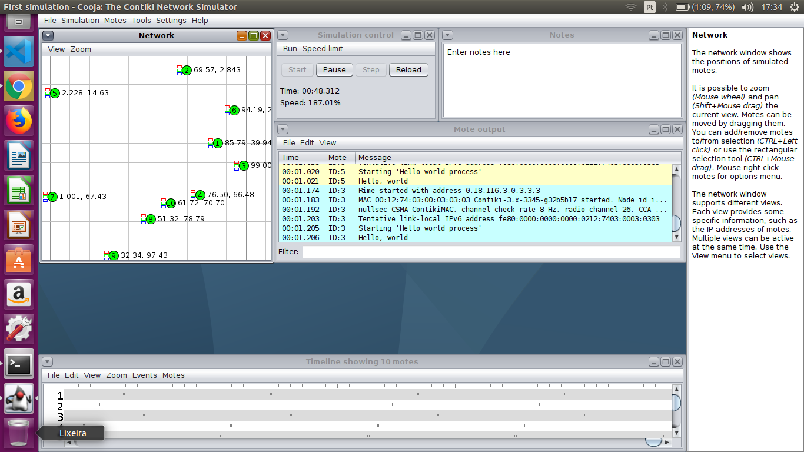

<div align="center">

<p><strong>UNIVERSIDADE FEDERAL DO CEARÁ <br> CAMPUS QUIXADÁ <br> CURSO DE TECNOLOGIA EM REDES DE COMPUTADORES</strong></p>
</div>

## Análise de Desempenho dos Protocolos CoAP e MQTT em Redes IoT

- <div style="text-align: justify"> Trabalho de Conclusão de Curso Intitulado: Análise de Desempenho dos Protocolos CoAP e MQTT em Redes IoT. Apresentado ao Curso de Tecnologia em Redes de Computadores da Universidade Federal  do  Ceará,  como  requisito  parcial  à obtenção do grau de Tecnólogo em Redes de Computadores. 
</div>

## Índice

1. [Lista de Tarefas](../../README.md)
   1. Instalar o Contiki-OS
   2. [Configurar um cenário teste com um nó RPL](../2_configurar_cenario_com_um_no_rpl/README.md)
      1. [Gráficos gerados](../2_configurar_cenario_com_um_no_rpl/1_graficos_gerados/README.md)
   3. [Configurar cenário com um nó RPL, protocolo de aplicação MQTT e cinco nós IoT](../3_configurar_cenario_rpl_mqtt_5_nos_iot/README.md)
    

<a name="Tarefa"></a>
## Tarefa :clipboard:

<a name="listaTarefas"></a>
- [x] Instalar o Contiki-OS, que detém do Simulador/Emulador Cooja, no ubuntu 16.04 LTS (máquina real :computer:) <a name="instalarContikiOS">

   * Tutorial utilizado para a instalação: <https://youtube.com/watch?v=MSqYGkZPhVw> 
      [](https://youtube.com/watch?v=MSqYGkZPhVw)
   ___

   * Passo 1: Pré requisitos de Instalação :hash::one:.
      ```bash
      sudo apt update

      sudo apt-get install build-essential binutils-msp430 gcc-msp430 msp430-libc msp430mcu mspdebug gcc-arm-none-eabi gdb-arm-none-eabi openjdk-8-jdk openjdk-8-jre ant libncurses5-dev lib32ncurses5
      ```

   * Passo 2: Download ou clone do contiki :hash::two:.
      - Opção de dowload do arquivo ZIP: <https://github.com/contiki-os/contiki>.
      - Opção via linha de comando: ```git clone https://github.com/contiki-os/contiki.git```.
    <br /> Obs: ***Neste trabalho** o **download** foi realizado por meio da **linha de comando** utilizando o comando **git clone**.*
      - Depois de baixado entre no diretório do contiki:
      - `cd contiki`

   * Passo 3: Atualizar os sub diretórios :hash::three:.
      - `git submodule update --init --recursive`.
  
   * Passo 4 executar o contiki :hash::four:.
      - ```bash
        $ cd tools/cooja/
        $ ant run
        ``` 

   * Simulador/Emulador Cooja em Execução :running: :
      

<div align="center">
<button><a href="../../README.md"><< Anterior<button> | 
<button><a href="../2_configurar_cenario_com_um_no_rpl/README.md">Próximo >></a></button>
</div>