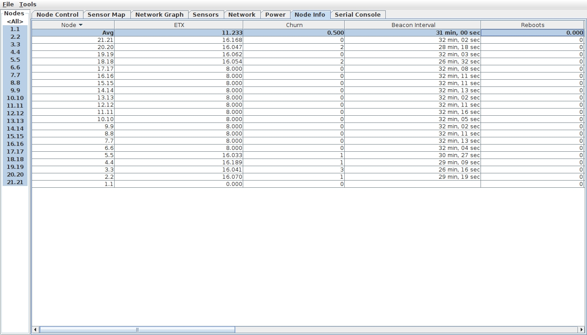
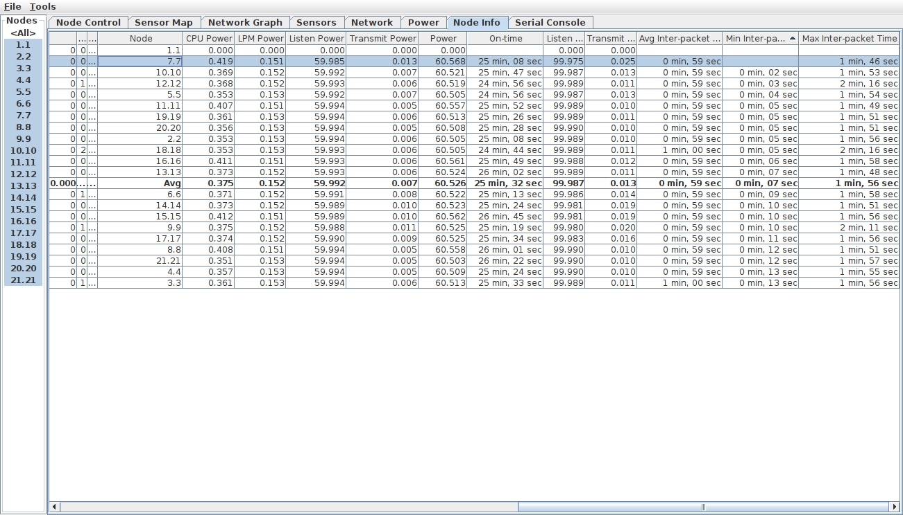

 

<strong>UNIVERSIDADE FEDERAL DO CEARÁ   CAMPUS QUIXADÁ   CURSO DE TECNOLOGIA EM REDES DE COMPUTADORES</strong>

## Análise de Desempenho dos Protocolos CoAP e MQTT em Redes IoT

- 
 Trabalho de Conclusão de Curso Intitulado: Análise de Desempenho dos Protocolos CoAP e MQTT em Redes IoT. Apresentado ao Curso de Tecnologia em Redes de Computadores da Universidade Federal  do  Ceará,  como  requisito  parcial  à obtenção do grau de Tecnólogo em Redes de Computadores. 

## Índice

1. [Lista de Tarefas](../../../README.md)
   1. [Instalar o Contiki-OS](../../1_instalar_contiki/README.md)
   2. [Configurar um cenário teste com um nó RPL](../README.md)
      1. Gráficos gerados
   3. [Configurar cenário com um nó RPL, protocolo de aplicação MQTT e cinco nós IoT](../../3_configurar_cenario_rpl_mqtt_5_nos_iot/README.md)

 ## Gráficos gerados

  * ***Network*** (**Rede**)
      
      

      
Avg Rounting Metric (Over Time)

      
      
                     

      

      
Beacon Interval

      
      
                

      

      
ETX (Over Time)

      
      
                

      

      
Latency

      
      
                                              

      

      
Lost (Over Time)

      
      
        
               
      

      
Neighbors

      
      
              

      

      
Network hops (Over Time)

      
      
                       

      

      
Network Hops (Per Node)

      
      
        

      

      
Next Hop (Over Time)

      
      
        
      
      

      
Received 5 Min

      
      
            
      
      

      
Received (Over Time)

      
      
           
      
      

      
Received (Per Node)

      
      
        
      
      

      
Rounting Metric (Over Time)

      
      
        
     
   * Grafo da rede
      

      
Network graph

      
      
             

   * Node Control
      

      
Node Control

      
      
  

   * Node Info
      

      
Node Info 1

      
      
             

      

      
Node Info 2

      
      
             

      

      
Node Info 3

      
      
             

   * Energia   
      

       
Power history

      
      
               
     
      

      
Average power

      
      

      

      
Instataneous power

      
      

      

      
Radio duty cycle

      
      

   * Sensors
      

      
Average temperature

      
      

      

      
Batery indicator

      
      

      

      
Batery voltage
         
      
      

      

      
Light 1

      
      

      

      
Light 2

      
      

      

      
Relative humidity

      
      

      

      
Temperature

      
      
         

   * Serial Console
      

      
Serial Console

      
      
    

   * Sensor Map     
      

      
Sensor Map

      
      

<button><a href="../../README.md"><< Anterior<button> | 
<button><a href="../../3_configurar_cenario_rpl_mqtt_5_nos_iot/README.md">Próximo >></a></button>

