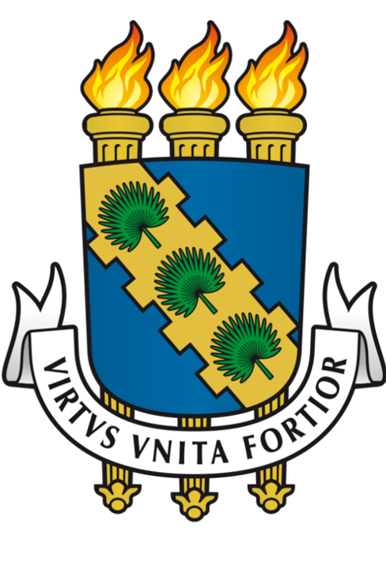

<div align="center">

<p><strong>UNIVERSIDADE FEDERAL DO CEARÁ <br> CAMPUS QUIXADÁ <br> CURSO DE TECNOLOGIA EM REDES DE COMPUTADORES</strong></p>
</div>

## Análise de Desempenho dos Protocolos CoAP e MQTT em Redes IoT

- <div style="text-align: justify"> Trabalho de Conclusão de Curso Intitulado: Análise de Desempenho dos Protocolos CoAP e MQTT em Redes IoT. Apresentado ao Curso de Tecnologia em Redes de Computadores da Universidade Federal  do  Ceará,  como  requisito  parcial  à obtenção do grau de Tecnólogo em Redes de Computadores. 
</div>

## Índice

1. [Lista de Tarefas](../../README.md)
   1. [Instalar o Contiki-OS](../1_instalar_contiki/README.md)
   2. Configurar um cenário teste com um nó RPL
      1. [Gráficos gerados](./1_graficos_gerados/README.md)
   3. [Configurar cenário com um nó RPL, protocolo de aplicação MQTT e cinco nós IoT](../3_configurar_cenario_rpl_mqtt_5_nos_iot/README.md)
   
<a name="listaTarefas"></a>
## Tarefa :clipboard:

- [x] Configurar um cenário teste contendo um nó RPL (*IPv6 Routing Protocol for Low Power and Lossy Networks*) em uma rede IoT. <a name="cenarioTesteRPL">
  
  * Tutorial utilizado para o teste: <https://www.youtube.com/watch?v=fI0_JA6O5nI> :movie_camera:.
  [](https://www.youtube.com/watch?v=fI0_JA6O5nI)
  
  ___
  
  * Inicialmente será criado um nó RPL. Para isso, foi criada uma nova simulação acessando o menu:
      ```
      File >> New Simulation
      ```
      Ou por meio da tecla de atalho `CTRL+N`, no campo *Simulation name* atribuiu-se o nome da simulação que neste caso foi `RPL UDP Sink and UDP Sender Collect View Test`, por fim clicou-se em `Create` para de fato criar a nova simulação.
   
      O nó RPL será do tipo UDP Sink.
      

  * O próximo passo será criar os nós do tipo UDP Sender.
      

  * Iniciando a simulação. 
      
  
  * Coletando dados a partir do collect view.
      
  
  * Collect View todas as abas.
      

<div align="center">
<button><a href="../1_instalar_contiki/README.md"><< Anterior<button> | 
<button><a href="./1_graficos_gerados/README.md">Próximo >></a></button>
</div>
     

