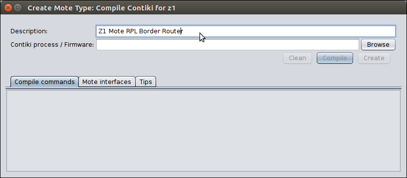

<div align="center">

<p><strong>UNIVERSIDADE FEDERAL DO CEARÁ <br> CAMPUS QUIXADÁ <br> CURSO DE TECNOLOGIA EM REDES DE COMPUTADORES</strong></p>
</div>

## Análise de Desempenho dos Protocolos CoAP e MQTT em Redes IoT

- <div style="text-align: justify"> Trabalho de Conclusão de Curso Intitulado: Análise de Desempenho dos Protocolos CoAP e MQTT em Redes IoT. Apresentado ao Curso de Tecnologia em Redes de Computadores da Universidade Federal  do  Ceará,  como  requisito  parcial  à obtenção do grau de Tecnólogo em Redes de Computadores. 
  </div>

## Índice

1. [Lista de Tarefas](../../README.md)
   1. [Instalar o Contiki-OS](../1_instalar_contiki/README.md)
   2. [Configurar um cenário teste com um nó RPL](../2_configurar_cenario_com_um_no_rpl/README.md)
      1. [Gráficos gerados](../2_configurar_cenario_com_um_no_rpl//1_graficos_gerados/README.md)
   3. Configurar cenário com um nó RPL, protocolo de aplicação MQTT e cinco nós IoT

<a name="listaTarefas"></a>

## Tarefa :clipboard:

- [ ] Configurar cenário com um nó RPL, protocolo de aplicação MQTT e cinco nós IoT.

  - [x] :sparkles: Baixando o protocolo de aplicação MQTT-SN na pasta do Contiki e executando o cenário teste. :sparkles: <br/> Tutorial utilizado: <https://www.youtube.com/watch?v=5qfoOCtIbEg>
        [](https://youtube.com/watch?v=5qfoOCtIbEg)

    - Navegar até o diretório do Contiki e clonar o mqtt-sn.c: <br/>
      - `cd contiki`
      - `git clone https://github.com/aignacio/mqtt-sn-contiki.c`     

    - Renomear de `mqtt-sn-contiki_example` para `mqtt-sn-contiki`.
      - `mv mqtt-sn-contiki_example mqtt-sn-contiki`

    - Os proxímos passos, criação dos nós RPL, MQTT-SN e as configuração necessárias para rodar o cenário teste, serão executados nos tópicos seguintes.
    
  - [ ] Configurando o cenário proposto.

    - [x] :sparkles: Criar um novo mote _Border Router_. :sparkles: <br/>

      - `Motes -> Add Motes -> Create new mote type -> Z1 mote`.

        

      - Inserindo a descrição que é um nó do tipo Z1 mote e que será o border router:

        

      - Pelo botão _Browser_ foi selecionado o arquivo `border-router.c`.
        O Caminho do arquivo **_border-router.c_** é: `contiki/examples/ipv6/rpl-border-router/border-router.c`. Clique no arquivo `border-router.c` e em seguida clique em _Open_:

        

      - Clique no botão **_Compile_** para compilar o código do arquivo **_border-router.c_**:

        

      - Após o término da compilação, para continuar o processo de criação do nó RPL clique em **_Create_**.

        

      - Informando quantos nós RPL serão criados (_Number of new motes_). Nesse caso o valor não será modificado pois necessitamos de apenas um nó RPL para este cenário. Ao final clique em **_Add motes_** adicionando realmente o nó RPL ao cenário.

        

      - Nó **_RPL Boder Router_** criado!:

        

    - [x] :sparkles: Criar cinco nós MQTT-SN. :sparkles: <br/>

      - `Motes -> Add Motes -> Create new mote type -> Z1 mote`.

        

      - Inserindo a descrição que é um nó MQTT-SN.
        

      - Pelo botão _Browser_ foi selecionado o arquivo `main_core.c`.
          O Caminho do arquivo **_main_core.c_** é: `contiki/mqtt-sn-contiki/main_core.c`. Clique no arquivo `main_core.c` e em seguida clique em _Open_: 

                 

      - Clique no botão **_Compile_** para compilar o código do arquivo **_main_core.c_**:

          

      - Após o término da compilação, para continuar o processo de criação do nó MQTT-SN clique em **_Create_**.

          

      - Informando quantos nós RPL serão criados (_Number of new motes_). Para este cenário serão utilizados cinco nós MQTT-SN. Ao final clique em **_Add motes_** adicionando realmente os nós MQTT-SN ao cenário.

        

      - 5 Motes MQTT-SN criados:
        

 
    - [ ] Configurando o cenário.
     
      - Clicar com o botão direito no _Border Router_ - _Motel Tool_ - _Serial Socket (Server)_

        - `cd contiki/examples/ipv6/rpl-border-router - make connect-router-cooja`.

        - `cd contiki/mqtt-sn-contiki/tools/mosquitto.rsmb/rsmb/src - make`.

        - `cd contiki/mqtt-sn-contiki/tools/mosquitto.rsmb/rsmb/src - sudo ./broker_mqtts config.mqtt`.

  - [ ] Rodar a Simulação.

    - Ao tentar rodar o seguinte erro ocorria:

    

    Devido a uma modificação realizada no arquivo main_core.c para teste de debug este erro ocorria. Então a linha (`debug_os(broker_address);`) foi devidamente comentada e o erro foi sanado.

    

    

  - Informativos da execução do presente tutorial.

    - Resolvido como declarar e exportar a variavel $JAVA_HOME.

      O caminho depende do seu sistema operacional, você pode verificar o caminho completo usando o comando:

      ```bash
      $ sudo update-alternatives --config java.
      ```

      Uma forma de configurar a variável de ambiente JAVA_HOME é por meio do
      arquivo `/etc/environment`. Abra o arquivo:

      ```bash
      $ sudo nano /etc/environment
      ```

      Insira o comando abaixo atribuindo o devido caminho do Java instalado na máquina:

      ```bash
      JAVA_HOME="/usr/lib/jvm/java-8-openjdk-amd64"
      ```

      Em seguida utilize o comando abaixo para recarregar as variáveis:

      ```bash
      $ source /etc/environment
      ```

      A partir disso a variável JAVA_HOME já deve retornar o path que foi configurado:

      ```bash
      $ echo $JAVA_HOME

      /usr/lib/jvm/java-8-openjdk-amd64
      ```

    - Ao tentar utilizar os nós do tipo sky mote, ocorre um erro.
    - Cenário construído com os nós sky, porém a troca das mensagens não passa pelo Broker.
    - Ainda não identificado o motivo dos nós no contiki não publicarem/increverem nos topicos.

<div align="center">
   <button>
      <a href="../2_configurar_cenario_com_um_no_rpl/1_graficos_gerados/README.md"><< Anterior</a>
   <button>
</div>
